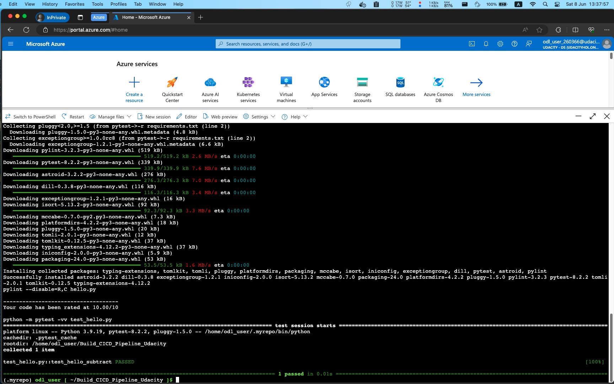

# Building CICD Piepline to Deploy ML with Azure DevOps
[](https://dev.azure.com/loxvuonfire01/microk8s/_build/latest?definitionId=17&branchName=master)

# Overview
In this project, we will buil CICD Piepline to Deploy ML with Azure DevOps

## Architecture Diagram

Source: Udacity

We use GitHub as repository, Azure Pipelines for CI/CD, Azure App Service for deployment, and Flask with Sklearn for the Machine Learning model.

# Project Plan
## Spreadsheet
https://docs.google.com/spreadsheets/d/1wwPCObb3EBmOaZjHSTcR8W9PkRywCyxSx-h5_dssoDQ/edit?usp=sharing

## Trello Board
https://trello.com/invite/b/6Qbl0woS/ATTI8f999c633d862464f48ec2d769779f8dA9279F62/agileboard

# Instructions

## Video Record:
https://youtu.be/YDsbKvnjf5g

1. Clone the repository
```bash
git clone https://github.com/vunguyen22271/Build_CICD_Pipeline_Udacity.git
```

2. Change directory to the project
```bash
cd Build_CICD_Pipeline_Udacity
```

3. Create a virtual environment and install dependencies
```bash
python -m venv antenv
source antenv/bin/activate
python -m pip install --upgrade pip
pip install setup
pip install -r requirements.txt
```

4. Run the app
```bash
python app.py
```

5. Test the app
```bash
./make_prediction.sh
```

6. Run the app with locust
```bash
locust -f locustfile.py
```


7. Open a browser and go to http://localhost:8089
8. Enter the number of users to simulate and the hatch rate
9. Click Start Swarming
10. Monitor the results
11. When done, click Stop

13. Upload app to Azure App Service
```bash
az webapp up --name flask-ml-Azure-vunguyen22271 --resource-group Azuredevops --sku B1 --logs --runtime "PYTHON|3.8"
```

14. Test the app in Azure Cloud Shell
```bash
./make_predict_azure_app.sh
```


## Improve the project
- In the future, we can add more tests to the project to ensure the quality of the code.
- We can also add more features to the app to make it more useful.

## Rubric - Continuous Integration

### A screenshot showing the project cloned into Azure Cloud Shell.


### A screenshot showing the passing tests that are displayed after running the make all command from the Makefile.


### Take screenshot of passing GitHub Actions build and put into README.md


### A screenshot of the application running against a load test with locust


### A screenshot of Azure Azure App Service


### A screenshot of a successful prediction in Azure Cloud Shell


### The README contains a screenshot of a successful run of the project in Azure Pipelines.


